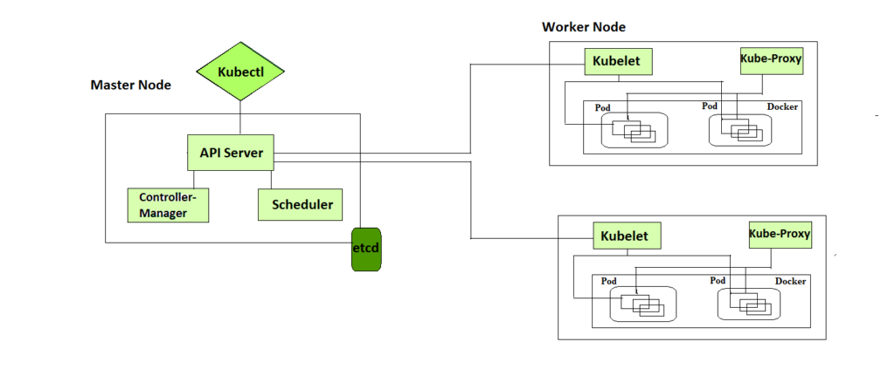

Kubernetes (also known as k8s or “kube”) is an open source container orchestration platform that automates many of the manual processes involved in deploying, managing, and scaling containerized applications.

**What is a Kubernetes cluster?**   

    A working Kubernetes deployment is called a cluster, which is a group of hosts running Linux® containers. You can visualize a Kubernetes cluster as two parts: the control plane and the compute machines, or nodes.

  

     
    Each node is its own Linux environment, and could be either a physical or virtual machine. Each node runs pods, which are made up of containers. 

    The control plane is responsible for maintaining the desired state of the cluster, such as which applications are running and which container images they use. Compute machines actually run the applications and workloads. The control plane takes commands from an administrator (or DevOps team) and relays those instructions to the compute machines.

    This handoff works with a multitude of services to automatically decide which node is best suited for the task. Services decouple work definitions from the pods and automatically get service requests to the right pod—no matter where it moves in the cluster or even if it’s been replaced. It allocates resources and assigns the pods in that node to fulfill the requested work.

    Kubernetes runs on top of an operating system (Red Hat Enterprise Linux, for example) and interacts with pods of containers running on the nodes.

    The desired state of a Kubernetes cluster defines which applications or other workloads should be running, along with which images they use, which resources should be made available to them, and other such configuration details.

    There is little change to how you manage containers using this type of infrastructure. Your involvement just happens at a higher level, giving you better control without the need to micromanage each separate container or node. 

    Where you run Kubernetes is up to you. This can be on bare metal servers, virtual machines (VMs), public cloud providers, private clouds, and hybrid cloud environments. One of Kubernetes’ key advantages is it works on many different kinds of infrastructure.

**Benefits of Using Kubernetes**

    1. Automated deployment and management
    If you are using Kubernetes for deploying the application then no need for manual intervention kubernetes will take care of everything like automating the deployment, scaling, and containerizing the application.
    Kubernetes will reduce the errors that can be made by humans which makes the deployment more effective.

    2. Scalability
    You can scale the application containers depending on the incoming traffic Kubernetes offers Horizontal pod scaling the pods will be scaled automatically depending on the load.

    3. High availability
    You can achieve high availability for your application with the help of Kubernetes and also it will reduce the latency issues for the end users.

    4. Cost-effectiveness
    If there is unnecessary use of infrastructure the cost will also increase kubernetes will help you to reduce resource utilization and control the overprovisioning of infrastructure.

    5. Improved developer productivity
    Developer can concentrate more on the developing part kubernetes will reduce the efforts of deploying the application

**Kubernetes vs. Docker**

    Docker can be used as a container runtime that Kubernetes orchestrates. When Kubernetes schedules a pod to a node, the kubelet (the service that makes sure each container is running) on that node will instruct Docker to launch the specified containers.

    The kubelet then continuously collects the status of those containers from Docker and aggregates that information in the control plane. Docker pulls containers onto that node and starts and stops those containers.

    The difference when using Kubernetes with Docker is that an automated system asks Docker to do those things instead of the admin doing so manually on all nodes for all containers.

**What is Kubernetes used for?**

    Kubernetes can help you deliver and manage containerized, legacy, and cloud-native apps, as well as those being refactored into microservices. 

    In order to meet changing business needs, your development team needs to be able to rapidly build new applications and services. Cloud-native development starts with microservices in containers, which enables faster development and makes it easier to transform and optimize existing applications. 

    Application development with Kubernetes
    Production apps span multiple containers, and those containers must be deployed across multiple server hosts. Kubernetes gives you the orchestration and management capabilities required to deploy containers, at scale, for these workloads.

    Kubernetes orchestration allows you to build application services that span multiple containers, schedule those containers across a cluster, scale those containers, and manage the health of those containers over time. With Kubernetes you can take effective steps toward better IT security.

    Kubernetes also needs to integrate with networking, storage, security, telemetry, and other services to provide a comprehensive container infrastructure.

    

  

    Once you scale this to a production environment and multiple applications, it's clear that you need multiple, colocated containers working together to deliver the individual services. 

    Linux containers give your microservice-based apps an ideal application deployment unit and self-contained execution environment. And microservices in containers make it easier to orchestrate services, including storage, networking, and security.

    This significantly multiplies the number of containers in your environment, and as those containers accumulate, the complexity also grows.

    Kubernetes fixes a lot of common problems with container proliferation by sorting containers together into "pods." Pods add a layer of abstraction to grouped containers, which helps you schedule workloads and provide necessary services—like networking and storage—to those containers. 

    Other parts of Kubernetes help you balance loads across these pods and ensure you have the right number of containers running to support your workloads.

    With the right implementation of Kubernetes—and with the help of other open source projects like Open vSwitch, OAuth, and SELinux— you can orchestrate all parts of your container infrastructure.
