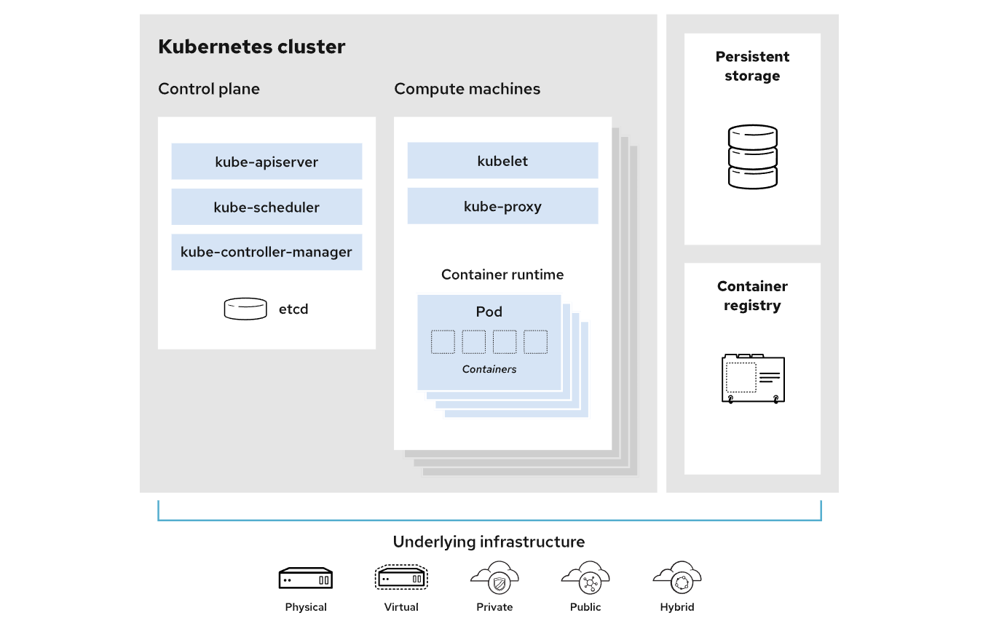

Kubernetes (also known as k8s or “kube”) is an open source container orchestration platform that automates many of the manual processes involved in deploying, managing, and scaling containerized applications.

What is a Kubernetes cluster?   

    A working Kubernetes deployment is called a cluster, which is a group of hosts running Linux® containers. You can visualize a Kubernetes cluster as two parts: the control plane and the compute machines, or nodes.

     

    Each node is its own Linux environment, and could be either a physical or virtual machine. Each node runs pods, which are made up of containers. 

    The control plane is responsible for maintaining the desired state of the cluster, such as which applications are running and which container images they use. Compute machines actually run the applications and workloads. The control plane takes commands from an administrator (or DevOps team) and relays those instructions to the compute machines.

    This handoff works with a multitude of services to automatically decide which node is best suited for the task. Services decouple work definitions from the pods and automatically get service requests to the right pod—no matter where it moves in the cluster or even if it’s been replaced. It allocates resources and assigns the pods in that node to fulfill the requested work.

    Kubernetes runs on top of an operating system (Red Hat Enterprise Linux, for example) and interacts with pods of containers running on the nodes.

    The desired state of a Kubernetes cluster defines which applications or other workloads should be running, along with which images they use, which resources should be made available to them, and other such configuration details.

    There is little change to how you manage containers using this type of infrastructure. Your involvement just happens at a higher level, giving you better control without the need to micromanage each separate container or node. 

    Where you run Kubernetes is up to you. This can be on bare metal servers, virtual machines (VMs), public cloud providers, private clouds, and hybrid cloud environments. One of Kubernetes’ key advantages is it works on many different kinds of infrastructure.